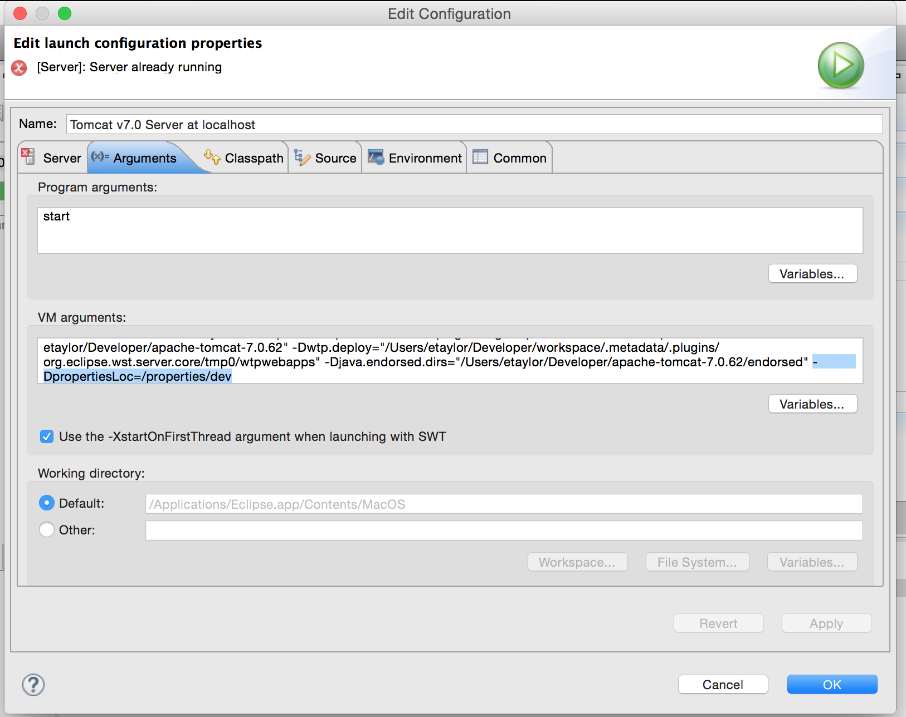

# API-GraduateSchool [](http://ec2-54-165-8-77.compute-1.amazonaws.com/job/Dev-Env-API-GraduateSchool)
Java/Spring API Layer for Graduate School

<h2>Runs on</h2>
- Java 8
- Apache Tomcat 7.0.62

<h2>Requires Oracle Driver OJDBC </h2>
Due to Oracle license issues the Maven Central cannot hold the Oracle JBCD JAR.  Therefore you need to
install it in your local Maven repo.  The JAR is includes in the /src/lib folder so just run the Maven
command below to install it
```
> mvn install:install-file -DgroupId=com.oracle -DartifactId=ojdbc14 -Dversion=10.2.0.5 -Dpackaging=jar -Dfile=src/lib/ojdbc14.jar -DgeneratePom=true
```

<h2>Maven command to build</h2>
```
> mvn eclipse:clean clean -U install eclipse:eclipse -Dwtpversion=2.0
```

<h2>Running API on Apache Tomcat</h2>
- Add the following Tomcat argument to pick the right properties file<br/>
-- For Dev:  ```-DpropertiesLoc=/properties/dev```<br/>
-- For Prod: ```-DpropertiesLoc=/properties/prod```<br/>

- To run in a standalone Tomcat (Linux) add a file "setenv.sh" to the /conf folder with:</br>
```
JRE_HOME=/Library/Java/JavaVirtualMachines/jdk1.8.0_20.jdk/Contents/Home/jre
CATALINA_OPTS="-DpropertiesLoc=properties/dev"
```
NOTE: JRE_HOME is optional but if you are running multiple Java version this is a way to handle it.

<h2>Code Consistency</h2>
Import the file "eclipse-code-formatter.xml" in the root of this project into your Eclipse IDE for code consistency.  If using Intellij check this out: https://plugins.jetbrains.com/plugin/6546

<h2>Postman</h2>
The APIs can be run using Postman.  A Postman collection is included in the repo.
- Download Postman Client: https://www.getpostman.com/
- Import Collection from:
```
API-GraduateSchool/src/doc/GraduateSchool-API.json.postman_collection
```
- Import Environments from:
```
API-GraduateSchool/src/doc/dev.postman_environment
API-GraduateSchool/src/doc/local.postman_environment
```
- Set your Environment (upper right corner - local, dev, etc)
- Run any of the APIs
<h3>Running API Tests using Newman</h3>
Newman is the command line runner for Postman tests (Postman tests require jetpacks addon).
```
> cd src/doc
> newman -c GraduateSchool-API.json.postman_collection -e local.postman_environment
```
To install newman (for use with Node 4.0+) run:
```
> npm install -g newman@beta
```
To install newman (for use with older versions of Node) run:
```
> npm install -g newman
```

<h2>Solr Installation for Tomcat 7 and JDK8</h2>
-Please follow the steps in this document to install Solr
http://ericsod.com/2014/12/22/java-8-tomcat-7-and-solr-43-yosemite-drupal-development
